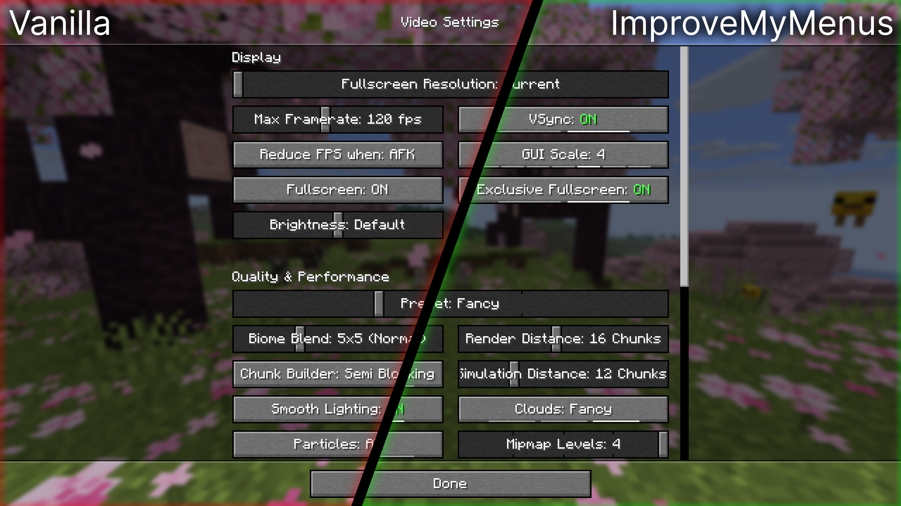
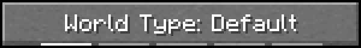
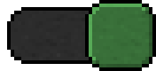

# [Download on Modrinth](https://modrinth.com/mod/improvemymenus)

A collection of small improvements to various aspects of Minecraft's menus.

# Why?

My aim with this mod was to improve the user experience of Minecraft's menus, while preserving the Vanilla feel and look.

Most features added by this mod only slightly tweak Vanilla behavior to feel smoother and more responsive.
There are also some bigger additions like indicators, but I tried to avoid big changes away from Vanilla.
Finally, I also added the ability to customize some normally hard-coded key-bindings.

# Feedback

Since my goal is to improve user experience with Minecraft's menus I would greatly appreciate feedback.
Feel free to fill out this [short form](https://forms.gle/7f7TYWbX2aogkBnu8) if your interested in providing feedback.

# Features

This mod contains a variate of features split into different categories.

Feel free to create a [Feature Request]() if you want to request something new,
or alternatively you can create a [Bug Report]() if something's broken.

## Cycle Button

### Indicators

These allow you to instantly gauge the amount of possible options and 
additionally provide a way to quickly navigate when pressed.

### Colored On/Off text

Helps you to immediately recognize the value of an On/Off button. 

### Switches

Transforms buttons which only contain the word ON or OFF into simpler, more recognizable switches.

## Sliders

### Indicators

Sliders with few values will have indicators, helping you use them.

### Snapping

Vanilla has a 600ms delay before snapping for some slider, 
removing this delay makes the slider feel more responsive.

|                | Comparison                                                                                                       |
|----------------|------------------------------------------------------------------------------------------------------------------|
| Vanilla        |          |
| ImproveMyMenus |  |

### Spacing

Vanilla leaves big gaps at the edges of sliders, which can act unintuitively.

|                | Comparison                                                                                             |
|----------------|--------------------------------------------------------------------------------------------------------|
| Vanilla        |      |
| ImproveMyMenus |  |

## Cursor

The cursor doesn't lose its arrow shape when dragging a slider or scrollbar outside its area.

## Improved Debug Options

Added translations for debug options, 
redesigned the tri-state toggle and 
restores the previous screen upon closing the settings.

## High Contrast Support

Built-in support for the "High Contrast" vanilla resource pack.

## Customization

Every visual change can be modified using a resource pack, none of them are hard-coded.
The "Debug Options" translations are extendable using a resource pack,
you can add additional translations if you're using a mod with additional ones.
You can even add tooltips by appending `.tooltip` to the original translation key.

# Configuration

It's recommended to install [Mod Menu](https://modrinth.com/mod/modmenu) in order to access the mods configuration screen.

Without mod menu you can also access the config by running the command `/improvemymenus-config`.

Explanations of every config option

## Cycle Button

A cycle button is a button with multiple values.

In the most basic buttons these values are either `ON` or `OFF`, but there are many more possibilities.

### Scrolling

Default: `ON` 
Vanilla: `ON`

Determines if scrolling will cycle values.
When enabled scrolling up will select the previous value and scrolling down the next one.
(Yes, this is the Vanilla behavior. No, I don't know why it's like this)

### Show Alternatives

Default: `Alt` 
Vanilla: `Alt`

Pressing this modifier will show an alternative set of values, when supported by the button.
In Vanilla this only affects the "World Type".

### Next

Default: `Left Click` 
Vanilla: `Left Click`

Pressing this button will cycle to the next value.

### Previous

Default: `Shift Left Click` 
Vanilla: `Shift Left Click`

Pressing this button will cycle to the previous value.
This button takes priority over `Next`.

### Indicators

Default: `ON` 
Vanilla: `OFF`

One of the few bigger visual changes of this mod.
My intention behind this feature was to make gauging the amount of available options easier and 
to provide an easier method to cycle through large amounts of values quickly.

Every indicator corresponds to one value of the button, 
and the currently selected one will be highlighted.

### Indicator

Default: `Left Click` 
Vanilla: `Unbound`

When set to anything other than `Unbound` hovering over an indicator will show a preview of the selected value.
Hovering over an indicator and pressing this button will select the hovered indicator.

### Switches

Default: `ON` 
Vanilla: `OFF`

Minecraft uses cycle buttons for everything even in places where other kinds of buttons would be more appropriate.
Enabling this features displays switches in some of these cases, greatly improving visually clarity.

### Dropdown

Default: `Unbound` 
Vanilla: `Unbound`

This is another big feature, but I'm not really happy with it, that's also why I didn't mention it under "Features".
But I decided to leave it in the mod since I had already coded it.

When pressing the selected button a dropdown will open allowing you to select one of the possible values.
You can navigate the dropdown by scrolling or directly clicking on the desired button.
Pressing enter will save changes made and close the dropdown.
Clicking next to the buttons or pressing escape will close the dropdown and discard any changes made.

### On-Off Colors

Default: `ON` 
Vanilla: `OFF`

This colors the words `ON` and `OFF` green and red respectively. (This is a small simplification)

This isn't limited to cycle buttons, but usually only affects them.

### Random Colors

Default: `OFF` 
Vanilla: `OFF`

Also, not really happy with this one, the set of possible colors is pretty small so duplicates occur way to often.
I might rework this in the future.

Assigns a deterministic random color to every possible value, helping differentiate between values at a glance.

## Sliders

### Max Indicators

Default: `5` 
Vanilla: `0`

The maximum amount of indicators to show.
Settings this to `0` will completely disable slider indicators.

### Highlights

Default: `OFF` 
Vanilla: `OFF`

Turning this on highlights the currently selected indicator, as in the value you would select by clicking.

### Spacing

Default: `Visual` 
Vanilla: `Area`

Spacing determines the position of discrete values inside a slider.

Visual spacing leaves equal space between consecutive values. 
Area spacing assigns each value an area of equal size, leading to bigger spaces at the edge of a slider. 
Mixed spacing uses area spacing to detect clicks, but visual spacing to show values.

### Enum Spacing

Default: `Mixed` 
Vanilla: `Mixed`

The same as spacing but for non-number values.

The only slider with enum spacing in vanilla is the "Profile" slider in "Video Settings".

### Snap

Default: `On Release` 
Vanilla: `Vanilla`

Determines at which moment in time a slider should snap to the nearest discrete value.

The vanilla behavior for some sliders is very weird, they snap after not moving for 600ms, 
even if you are still holding them. Otherwise, it's the same as On Release.

On Release snaps as the name say upon releasing the slider. 
While Dragging snaps while you are still dragging the slider, jumping between values.

### Force Cursor

Default: `ON` 
Vanilla: `OFF`

When leaving the area of a slider the cursor changes back to the default cursor, 
even if you are still dragging the slider. 
This forces the cursor to stay the arrow until you release the slider.

## Lists

### Scroll

Default: `Prefer Parent` 
Vanilla: `Only Parent`

Changes which elements have priority when scrolling.

Vanilla only scrolls the parent element (e.g. a list), even if that list can't be scrolled. 
Prefer Parent scrolls the child element (e.g. a button) if the list can't be scrolled. 
Prefer Children also scrolls the child element if the list can be scrolled.

### Force Cursor

Default: `ON` 
Vanilla: `OFF`

When leaving the dragging the scrollbar handle outside the scrollbar area, the cursor looses its arrow shape.
Turning this on fixes that behavior and forces the cursor to remain an arrow until you release the handle.

## Other

### Zoom

Default: `Everywhere` 
Vanilla: `In Video Settings`

While coding this mod I discovered that you can zoom inside the Video Settings screen by pressing control and scrolling.
I decided to add a bit of customization to this behavior.

Nowhere, disables this zooming behavior. 
In Video Settings only allows it in the named screen and
Everywhere allows it everywhere.

## Unblur Video Settings

Default: `ON` 
Vanilla: `OFF`

Unblur the background in the "Video Settings" screen.
This helps see how different settings affect the visual clarity, 
without having to close and reopen the settings.

## Improve Debug Options

Default: `ON` 
Vanilla: `OFF`

I really don't like the vanilla debug options, the tri-state toggle it uses feels very unintuitive, at least for me.
So I decided to redesign this toggle, additionally I added translations for all vanilla options, 
since they look better than raw ids.

Another thing I noticed while testing my changes is that closing the "Debug Options" screen always returns to
the title screen or in-game menu, so I also fixed that making it return the previous screen.

*Disclaimer: The only usage of AI was a local model run as part of IntelliJ's built-in code completion, no coding agents, image generation software, etc. were used*